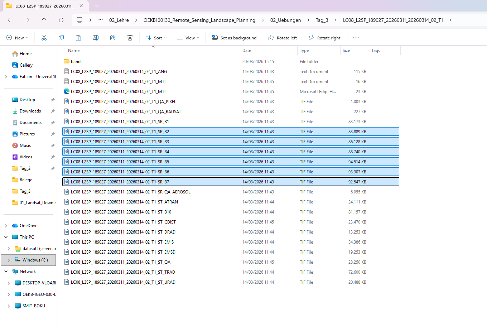
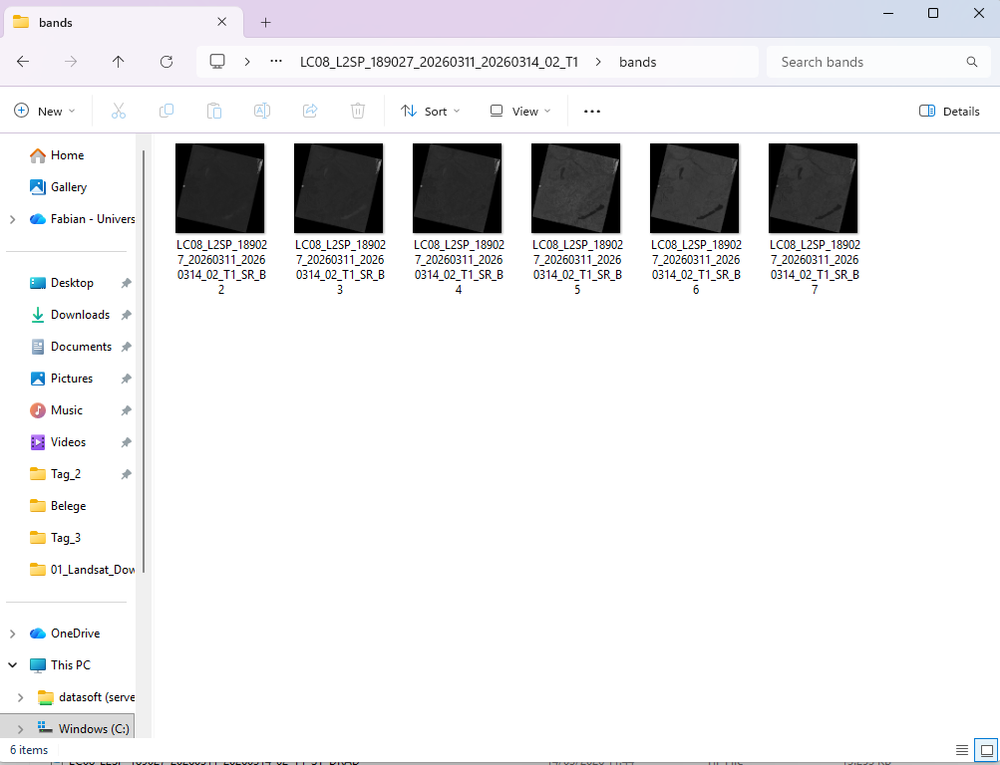
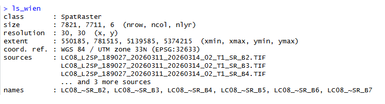

Fernerkundung in der Landschaftsplanung - Tag 3 - Prozessierung von Landsatdaten in R

**Autoren:** Dieses Tutorial wurde von Fabian Fassnacht entwickelt.

## Grundlegende Prozessierung von Landsat-Daten with R ##

### Overview ###

In diesem Tutorial lernen Sie den grundlegenden Umgang mit Landsat-Daten in der Programmierumgebung R (als ein Beispiel für multispektrale Satellitendaten). Zu den behandelten Verarbeitungsschritten gehören:

- Laden von Landsat-Daten
- Visualisieren von Landsat-Daten
- Zuschneiden von Landsat-Daten mit einer Vektordatei
- Maskieren von Landsat-Daten

Die in diesem Tutorial verwendeten Datensätze sind hier verfügbar:

https://drive.google.com/drive/folders/1cKngQQMJCMTNfnh1OXvygAX5ntseIJ8X?usp=sharing

### Verwendete Datensätze ###

In diesem Tutorial verwenden wir ein Landsat-8 und ein Landsat-9-Bild. Genauer gesagt nutzen wir Produkte, die Informationen zur Oberflächenreflexion enthalten. DIe Bilder wurden von der USGS Earth Explorer-Webseite [https://earthexplorer.usgs.gov/](https://earthexplorer.usgs.gov/) heruntergeladen. Wie man die entsprechenden Bilder herunterlädt, wird in den Hausaufgaben von dieser Woche behandelt (siehe Ende des Tutorials).

Detaillierte Informationen (Level-2 Scene-based Science Products-Handbücher) zur Struktur der zwei Datensätze finden Sie hier: [https://www.usgs.gov/landsat-missions/landsat-science-products](https://www.usgs.gov/media/files/landsat-8-9-collection-2-level-2-science-product-guide)

Es ist sehr lohnenswert, sich diese Informationen anzusehen, da sie der Schlüssel dafür sind die heruntergeladenen Produkte vollkommen zu verstehen. Sie werden sehen, dass die heruntergeladenen Datensätze aus einer Vielzahl an Dateien bestehen und die Information was diese Dateien genau enthalten finden sich alle in den oben genannten **Level-2 Scene-based Science Products**-Handbüchern.

### Schritt 1: Vorbereitung der Satellitenbilddaten

Bitte laden Sie die oben verlinkten Dateien herunter und speichern Sie sie in einem Ordner, den sie wiederfinden können. Danach navigieren Sie in den Ordner und entpacken Sie die zwei gepackten Dateien. Dies sollte zu zwei neuen Ordnern führen, die jeweils eine grössere Zahl an Dateien enthält (Abbildung 1 zeigt ein Beispiel für die Landsat 8 Szene).

**Abbildung 1: Die entpackte Landsat-Dateien**

Innerhalb dieses Ordners erstellen wir nun einen neuen Ordner, den wir "bands" nennen (rechtsklick => Neu => Ordner). Dann kopieren wir die 6 Hauptbänder (markiert mit 1 in Abbildung 1) von Landsat 8/9 (der Schritt ist derselbe, unabhängig davon ob man das Landsat 8 oder Landsat 9 Bild verwendet) in den soeben erstellten Ordner. Wenn wir diesen Ordner nun öffnen sollte das zu einer Situation führen wie sie in Abbildung 2 dargestellt ist.

**Abbildung 2: Die sechs Landsat-Bänder in einem separaten Ordner**

Nun haben wir alles vorbereitet, um das Satellitenbild in R zu laden.

### Schritt 3: Starten von R-Studio und erste Schritte ###

Wir starten nun das Programm R-Studio indem wir im Startmenü von windows "Rstudio" eintippen und das entsprechende Symbol klicken (Abbildung 3).

**Abbildung 3: Starten von R-Studio**

An diesem Punkt gehe ich davon aus, dass Sie die Hausaufgabe von letzter Woche in Form des Tutorials auf dieser Webseite: 

https://rspatial.org/intr/2-basic-data-types.html

durchgearbeitet haben. Sollten Sie dies nicht getan haben, würde ich raten dies nun zuerst zu tun, um den nachfolgenden Schritten gut folgen zu können. Es wird im Folgenden vorausgesetzt, dass Sie wissen, wie man Code in R-Studio ausführt und sie ein Grundverständnis dafür besitzen was Variablen sind und wie man mit diesen in R umgehen kann.

**Wichtige allgemeine Tipps zum Arbeiten mit R**

Vermutlich mindestens 90% aller Fehlermeldungen in R hängen mit einem der im folgenden gelisteten Punkte zusammen. Sollten Sie eine Fehlermeldung erhalten, so überprüfen sie bitte zuerst ob eine dieser Punkte das Problem sein könnte:

1. Der Pfad zu Dateien ist falsch (darauf achten entweder den kompletten Pfad zu einer Datei anzugeben, oder dass der aktuelle "Arbeitsraum" von R dem Ordner entspricht wo die entsprechende Datei liegt)
2. Variablennamen sind falsch geschrieben (**ACHTUNG:** R unterscheidet zwischen groß- und kleinschreibung; d.h., die variable "insekten" ist nicht dasselbe wie die Variable "Insekten" oder "inSekten")
3. Ein Paket ist nicht geladen (wenn sie versuchen einen Befehl anzuwenden, der in R nur über ein Paket zur Verfügung gestellt werden kann, können sie irreführende Fehlermeldungen erhalten)
4. Ein- oder Ausgangsdaten sind in einem falschen Datenformat (z.B. eine Tabelle kann nicht als Bild abgepeichert werden)

Das Ziel im Folgenden ist nicht, dass Sie sich den Code komplett selbst erarbeiten, sondern, dass sie ihn ausführen können und so anpassen, dass sie mit eigenen Daten dieselben Prozessierungen durchführen können.

### Schritt 4: Laden der Landsat-Daten ###

Als ersten Schritt laden wir das R-Paket "terra" welche die wichtigsten Funktionen für die Verarbeitung von geocodierten Bildern/Rasterdaten in R beinhaltet:

	require(terra)

R gibt eine Warnmeldung aus, falls ein Paket noch nicht installiert ist. Ist dies der Fall, installieren Sie die Pakete bitte entweder über das Hauptmenü von RStudio, indem Sie **„Tools“ =>** **„Install packages“** auswählen und den Anweisungen im angezeigten Dialog folgen, oder indem Sie den entsprechenden R-Code zur Installation der Pakete in die Konsole eingeben. Um beispielsweise das Paket „terra“ zu installieren, verwenden Sie den folgenden Code:

	install.packages(„terra“)    

Nachdem alle Pakete erfolgreich installiert wurden, laden wir das erste Satellitenbild in zwei Schritten. Dafür speichern wir zunächst die vollständigen Dateipfade aller Landsat-Bänder, die wir soeben in den "bands"-Ordner kopiert haben in einer Textvariable. Wir führen folgenden Befehl aus:

    bandnames <- list.files(„D:/remote_sensing/Landsat/Bands“, pattern="\\.tif$", full.names = T)
	bandnames

Der im obigen Code angegebene Dateipfad sollte so geändert werden, dass er mit dem Pfad übereinstimmt, unter dem Sie die entsprechenden Dateien auf Ihrem Computer gespeichert haben. Wenden Sie anschließend den Befehl „rast“ des terra-Pakets an, um das Bild in ein R-Rasterobjekt zu laden:

    ls_wien <- rast(bandnames)
	
Der Befehl „stack“ lädt noch nicht den gesamten Datensatz in den Speicher, sondern liest lediglich die Metadaten der Datei und stellt Verknüpfungen zu den Daten auf der Festplatte her. Führen Sie abschließend den Variablennamen aus, um eine Zusammenfassung der Rasterdatei zu erhalten:

    ls_wien

Dies sollte eine Konsolenausgabe wie die folgende ergeben:

### Schritt 2:  Visualisierung von Landsat-Daten ###

Nachdem wir die Landsat-Aufnahme geladen haben, möchten wir uns einen ersten Eindruck davon verschaffen, wie das Bild aussieht. Es gibt zwei grundlegende Möglichkeiten, die Satellitenaufnahme in R darzustellen. Die erste Möglichkeit nutzt den folgenden Code:

    plot(ls_wien)

Mit diesem Code werden alle Bänder der Satellitenaufnahme einzeln nebeneinander in einer Matrix aus Diagrammen dargestellt, wie unten gezeigt. 

In einigen Fällen kann die Ausführung des obigen Codes zu einer Fehlermeldung führen, dass die Ränder zu schmal sind, um die Daten darzustellen. Die Lösung für dieses Problem besteht darin, zunächst ein Popup-Fenster in R zu öffnen und dann den Plot-Befehl auszuführen. Dies funktioniert mit dem folgenden Code.

    x11()
    plot(ls_wien)

Diese Darstellung liefert uns zwar einige Informationen darüber, wie die einzelnen Bänder der Satellitenaufnahme aussehen, ist aber dennoch etwas enttäuschend, da wir normalerweise eine Echtfarben-Visualisierung der Satellitenaufnahme bevorzugen würden. Das heißt, eine Visualisierung, die den Eindruck nachahmt, den wir mit unserer visuellen Wahrnehmung erzeugen.

Für eine solche Darstellung benötigen wir einen anderen Plot-Befehl, der vom *terra*-Paket bereitgestellt wird:

	plotRGB(ls_wien, r=3, g=2, b=1, stretch="hist")

Der Befehl `plotRGB` erfordert mehrere Einstellungen, wie im Code zu sehen ist. Die erste Variable ist das darzustellende Bild. Anschließend müssen wir festlegen, welche Bänder des Bildes als die drei verfügbaren Farben r = rot, g = grün, b = blau dargestellt werden sollen. In unserem Fall ordnen wir die richtigen Landsat-Bänder den entsprechenden Darstellungsfarben zu. Das heißt, wir ordnen das Landsat-Band, das Informationen über Licht im roten Bereich des Spektrums sammelt, der roten Darstellung zu, den grünen Landsat-Kanal der grünen Darstellung und den blauen Landsat-Kanal der blauen Darstellung. Schließlich müssen wir eine Methode definieren, um die Bildwerte (Pixelwerte) auf den verfügbaren Visualisierungsbereich zu strecken. In unserem Fall weisen wir den Plot-Befehl an, ein Histogramm („hist“) zu verwenden, das aus einer repräsentativen Stichprobe von Bildpixeln erstellt wurde, um automatisch eine geeignete Streckungseinstellung zu finden. Detailliertere Informationen zum Befehl plotRGB erhalten Sie über die Hilfefunktion von R, die SIE für den Befehl plotRGB über

	?plotRGB

aufrufen können.

Wenn Sie den Befehl mit diesen Einstellungen ausführen, erhalten Sie ein Bild wie unten dargestellt. Dieses Bild entspricht mehr oder weniger unserer visuellen Wahrnehmung (das heißt, dem, was wir sehen würden, wenn wir mit einem Flugzeug oder einer Weltraumrakete über dieses Gebiet fliegen würden und die Atmosphäre sehr klar wäre). 

Solche Bilder lassen sich direkt interpretieren – grüne Bereiche stehen typischerweise für Vegetation, blaue Bereiche für Wasser und die weißen Bereiche für Schnee oder in diesem Fall für Wolken.

Diese Einstellungen sind zwar komfortabel, da wir die Informationen direkt interpretieren können, doch gibt es eine weitere Kombination von Bändern, die in Studien zur Vegetation häufig verwendet wird. Wie wir im Kurs gelernt haben, reflektiert Vegetation sehr stark im nahen Infrarotbereich des Lichts. Bislang wird diese Information jedoch nicht in der Visualisierung genutzt, da wir derzeit nur den roten, den grünen und den blauen Kanal des Landsat-Bildes verwenden. Wir werden dies nun ändern, indem wir den roten Kanal durch den Nahinfrarotkanal, den grünen durch den roten Kanal und den blauen durch den grünen Kanal ersetzen. Der entsprechende Befehl sieht wie folgt aus:

	plotRGB(ls_wien, r=4, g=3, b=2, stretch="hist")

Das resultierende Bild ist unten dargestellt. 

In diesem Bild erscheint die Vegetation nun in Rottönen, während grünliche Bereiche auf vegetationsfreie Gebiete hinweisen. Gewässer erscheinen sehr dunkel, da der größte Teil der elektromagnetischen Strahlung im nahen Infrarotbereich vom Wasser absorbiert wird, während die stärkste Reflexion des Wassers im Blaukanal auftritt, der bei dieser Visualisierungsoption nicht berücksichtigt wird.

#### Übung: Visualisierungseinstellungen erkunden #####

Um die bisher erlernten Befehle ein wenig zu üben, versuchen Sie, das zweite Bild aus den heruntergeladenen Daten zu laden. Speichern Sie das zweite Bild in einer Variablen namens **ls9_wien**. Experimentieren Sie noch ein wenig mit dem Befehl **plotRGB** und probieren Sie verschiedene Visualisierungseinstellungen aus (ändern Sie beispielsweise die für die Darstellung verwendeten Kanäle und beobachten Sie, wie sich die Farben des Bildes verändern).

### Schritt 3: Zuschneiden von Landsat-Daten ###

#### Ansatz 1: Zuschneiden auf die maximale Ausdehnung ####

Häufig ist unser Untersuchungsgebiet kleiner als eine vollständige Landsat-Szene, die mehrere tausend Quadratkilometer umfasst. In diesem Teil des Tutorials lernen wir daher, wie man mithilfe einer Polygon-Shapefile einen Teil der Landsat-Szene ausschneidet.

Als ersten Schritt laden wir die Shapefile, indem wir den folgenden Befehl ausführen:
    
    # wd auf Shapefile setzen
    setwd(„D:/remote_sensing/Landsat/Shape“)
    # Shapefile laden 
    vec<-vect("Wien_Bezirke.gpkg")

Die Ausführung dieses Befehls führt zu folgender Konsolenausgabe:

Eine grundlegende Zusammenfassung des geladenen Shapefiles erhält man, indem man einfach dessen Variablennamen aufruft. In unserem Fall:

    vec

Dies führt zu folgender Konsolenausgabe, die uns Informationen über die Ausdehnung des geladenen Shapefiles, die Anzahl der Objekte (Polygone) und das Koordinatenreferenzsystem liefert:

Als Nächstes werden wir das Shapefile über das Landsat-Bild legen, um zu sehen, ob die beiden Datensätze übereinstimmen und welchen Teil der Satellitenaufnahme wir ausschneiden werden. Dazu waren die folgenden Befehle erforderlich:

   	plotRGB(ls_wien, r=4, g=3, b=2, stretch="hist")
	plot(vec, add=T, col="red")

Dies sollte zu dem unten gezeigten Bild führen.

Wir können nun deutlich erkennen, dass sich das Shapefile mit dem Bild überschneidet, und sollten es daher nutzen können, um den Landsat-Datensatz zu beschneiden.

In diesem ersten Schritt verwenden wir die maximale Ausdehnung des Shapefile-Polygons, um das Satellitenbild zu beschneiden. Es gibt auch eine weitere Möglichkeit, das Bild anhand der exakten Form des Polygons zu beschneiden, aber darauf werden wir später noch eingehen.
 
Für den ersten Ansatz leiten wir zunächst die Ausdehnung der Shapefile mithilfe des Befehls ab:

    e <- ext(vec)

Wenn wir die Variable mit

    e

ausführen, sehen wir in der Konsolenausgabe die maximale Ausdehnung, die von der Shapefile abgedeckt wird.

Im nächsten Schritt verwenden wir diese Ausdehnungsvariable, um die Satellitenaufnahme zu beschneiden:

    setwd(„D:/remote_sensing/Landsat/Output“)
    ls_wien_clip <- crop(ls_wien, e, filename="ls_wien_clipped.tif", overwrite=TRUE)

Dieser Vorgang schneidet nun die Landsat-Aufnahme anhand des in der Variablen e gespeicherten Ausmaßes zu und speichert das zugeschnittene Bild in der Variablen ls_wien_clip. Zusätzlich wird eine neue TIF-Datei auf der Festplatte erstellt und im zuletzt definierten Pfad gespeichert (im Beispiel wechseln wir den Ordner, bevor wir den Befehl zum Zuschneiden ausführen, um zu steuern, wo die zugeschnittenen Dateien gespeichert werden).

Nach dem Zuschneiden können wir uns die zugeschnittene Satellitenaufnahme mit dem Befehl `plotRGB` ansehen:

	plotRGB(ls_wien_clip, r=3, g=2, b=1, stretch="hist")

Wir sehen nun, dass der von der beschnittenen Satellitenaufnahme abgedeckte Bereich deutlich kleiner ist als unsere ursprüngliche Aufnahme und im ausgegebenen Bild mehr Details sichtbar werden.

#### Ansatz 2: Zuschneiden auf den exakten Umriss der Shapefile-Datei ####

Um die Rasterdatei genau auf die Form des Polygons zu beschneiden, ist nur ein zusätzlicher Schritt erforderlich. Grundsätzlich bleibt das Beschneidungsverfahren dasselbe, doch nachdem das Bild auf die rechteckige Ausdehnung des Shapefiles beschnitten wurde, werden die verbleibenden Pixel, die sich nicht innerhalb des Polygons befinden, mit dem Befehl **mask** des *raster*-Pakets ausgeblendet. Das ergibt den folgenden Code:

	setwd(„D:/remote_sensing/Landsat/Output“)
    ls_wien_clip2 <- mask(ls_wien_clip, vec)

Der Maskierungsvorgang kann je nach Rechnerleistung recht lange dauern. Am Ende sollte das Bild wie folgt aussehen:

### SCHRITT 4: Anwenden einer Wolkenmaske ###

Im nächsten Schritt nutzen wir das Qualitätsprodukt, das standardmäßig zusammen mit den Landsat-8 und Landsat-9 Oberflächenreflexionsprodukt bereitgestellt wird. Sie finden das Qualitätsprodukt im selben Ordner wie die Bänder und erkennen es an der Dateiendung **_QA_PIXEL**. Da  das Landsat-9 Bild (**LC09_L2SP_190026_20260310_20260311_02_T1**) stärker von Wolken betroffen ist als das Landsat 8 Bild, verwenden wir diese Szene als Beispiel.

Um die Wolkenmaske zu laden, verwenden wir den bereits bekannten Code zum Laden eines Rasterbildes:

    setwd("D:/remote_sensing/Landsat9/")
	ls9_mask <- stack("LC09_L2SP_190026_20260310_20260311_02_T1_QA_PIXEL")

Wir können uns die gerade geladenen Daten ansehen, indem wir das Raster mit folgendem Befehl plotten:

    plot(ls9_mask)

Dies führt zu folgendem Bild:

Beachten Sie, dass es hier keinen Sinn macht, den Befehl **plotRGB** zu verwenden, da das Wolkenmaskenraster nur eine einzige Rasterebene bzw. einen einzigen Kanal enthält.

Wir sehen, dass das Qualitätsprodukt viele verschiedene Werte enthält, die jedoch trotzdem eher kategorisch als kontinuierlich aussehen. Um zu verstehen, was jede der Werte genau bedeutet, muss man den Leitfaden zur Oberflächenreflexion von Landsat 8 und 9 zu Rate ziehen (Link siehe oben).

Hier findet sich im Kapitel zum Qualitätsprodukt (Seite 19 und folgende Seiten) folgende Tabelle: 

Hier können wir nun erkennen, dass klare Pixel ohne Wolken oder sonstige Beeinträchtigungen den Wert "21824" ("Clear with lows set") besitzt. Höhere Werte sind entweder von Wolken oder Wolkenschatten betroffen oder repräsentieren Wasserflächen. Im Folgenden werden wir nun zuerst eine simple Maske anwenden, die alle Pixel, die keine klaren Landpixel repräsentieren ausschließt (d.h., Wasser und von Wolken betroffene Flächen werden maskiert).

Dazu erstellen wir zunächst eine binäre Maske aus dem Qualitätsproduktraster mit dem Befehl:

    ls9_quality_bin <- ls9_quality > 21824

Und sehen uns das Ergebnis an
	
    plot(ls9_quality_bin)

In dieser neuen Ebene sind nun alle Wasserflächen, sowie von Wolken oder Wolkenschatten betroffenen Bereiche mit dem Wert 1 gekennzeichnet, während alle Pixel, die entweder klar oder Gewässer sind, den Wert 0 haben.

Nun können wir diese Maske mit dem folgenden Befehl auf das Landsat-9 Bild  anwenden:

    ls9_wien_masked <- mask(ls9_wien, ls9_quality_bin, maskvalue=1,  updatevalue=NA)
	plotRGB(ls9_wien_masked, r=3, g=2, b=1, stretch="hist")

!! Beachten Sie, dass Sie zunächst das Bild ls9_wien erstellen müssen, indem Sie den oben für das Landsat-8-Bild bereitgestellten Code wie in der Übung beschrieben anpassen – dieser Code ist hier nicht enthalten!! 

Dies führt zu einer neuen Version des Landsat-Bildes, in der alle von Wolken betroffenen Pixel ausgeblendet wurden, indem alle Werte im Landsat-Bild durch NA (= nicht verfügbar) ersetzt wurden.

Um dieses Bild zu speichern, können wir entweder wie zuvor in der **crop()**-Funktion einen Dateinamen in der **mask()**-Funktion angeben oder einen separaten Befehl verwenden:

    writeRaster(ls9_wien_masked, filename="Landsat9_cloud_masked.tif", format="GTiff")

Möglicherweise möchten wir den aktuellen Pfad in einen Ausgabeordner ändern, bevor wir die Rasterdatei speichern. Dazu können Sie die **setwd()**-Funktion verwenden. Der writeRaster-Befehl ist allgemein wichtig um geokodierte Daten aus R zu exportieren, u.A. um Multiband-Raster (wie hier für die Landsat-Szenen erstelle)  dann z.B. in QGIS oder SNAP als solche öffnen zu können (aus den 6 einzelnen Raster für die jeweiligen Bänder wird ein Raster mit 6 Bändern/Kanälen).

